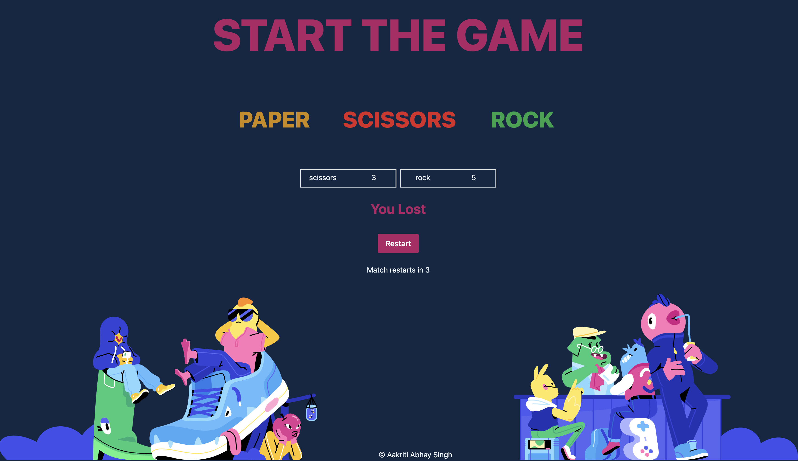

# javascript-rps-playground

This is a JavaScript-based Rock Paper Scissors game with added sound effects and a 10-second timer to restart the game. The game is built using Tailwind CSS for styling and provides an interactive experience for players.

<h1>Features</h1>
<h3>Rock, Paper, Scissors:</h3>
Play the classic game of Rock Paper Scissors against the computer. Choose your move by clicking on the respective buttons.

<h3>Sound Effects:</h3>
Enjoy the game with added sound effects for each move (rock, paper, and scissors).

<h3>10-Second Timer:</h3>
After either the computer or the user wins a round, the game automatically restarts after a 10-second countdown.

<h2>How to Play</h2>

1.When the game loads, you will see buttons for Rock, Paper, and Scissors.

2.Click on the button corresponding to your move (rock, paper, or scissors).

3.The computer will randomly select its move.

4.The game will display the result of the round (win, lose, or draw) and update the score.

5.After either the computer or the user wins, the game will automatically restart after a 10-second countdown.
